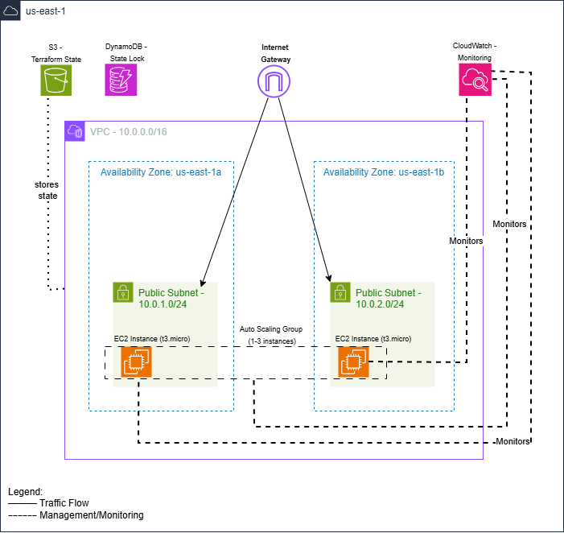

# Multi-Cloud Infrastructure as Code Platform

A production-grade infrastructure platform built with Terraform and AWS. This project demonstrates automated cloud infrastructure provisioning, auto-scaling capabilities, and enterprise-level infrastructure management practices.

Live Demo: http://3.232.133.225

## Overview

This project implements a fully automated infrastructure platform on AWS using Terraform. The infrastructure includes a custom VPC, auto-scaling EC2 instances, and comprehensive monitoring with CloudWatch alarms.

The platform was built to demonstrate practical skills in cloud architecture, infrastructure as code, and DevOps practices. All infrastructure is defined in code with no manual AWS console configuration required.

### What This Project Demonstrates

- Infrastructure as Code using Terraform with modular design
- AWS networking architecture with VPCs, subnets, and security groups
- Auto-scaling compute infrastructure with CloudWatch-based triggers
- Remote state management using S3 and DynamoDB
- Security best practices including encrypted state and least-privilege access
- Cost-conscious design using free tier eligible resources

## Architecture



*Multi-AZ architecture with auto-scaling compute layer, monitoring, and centralized state management*

The infrastructure consists of three main layers:

**Network Layer**
- Custom VPC spanning two availability zones
- Public subnets in us-east-1a and us-east-1b
- Internet Gateway for outbound connectivity
- Route tables configured for proper traffic flow

**Compute Layer**
- Auto Scaling Group with 1-3 EC2 instances
- t3.micro instances running Amazon Linux 2023
- Launch templates with automated web server configuration
- Security groups controlling inbound and outbound traffic

**State Management**
- S3 bucket with versioning and encryption for Terraform state
- DynamoDB table for state locking to prevent conflicts
- Separate state files for backend, networking, and compute layers

**Monitoring**
- CloudWatch alarms trigger scaling at 70% CPU utilization
- Automatic scale-down when CPU drops below 30%
- Health checks ensure only healthy instances receive traffic

## Technologies

- Terraform 1.14
- AWS (us-east-1 region)
- EC2 Auto Scaling Groups
- VPC networking components
- CloudWatch for monitoring and alarms
- S3 and DynamoDB for state management

## Quick Start

### Prerequisites

You need an AWS account, Terraform installed, and AWS CLI configured with your credentials.

### Deployment Steps

1. Clone this repository
```bash
git clone https://github.com/Dorcas-BD/multi-cloud-iac-platform.git
cd multi-cloud-iac-platform
```

2. Deploy the backend infrastructure
```bash
cd terraform/backend
terraform init
terraform apply
```

3. Deploy the networking layer
```bash
cd ../networking
terraform init
terraform apply
```

4. Deploy the compute layer
```bash
cd ../compute
terraform init
terraform apply
```

5. Get the public IP and access the application
```bash
aws ec2 describe-instances \
  --filters "Name=tag:Environment,Values=dev" "Name=instance-state-name,Values=running" \
  --query 'Reservations[*].Instances[*].PublicIpAddress' \
  --output text
```

Visit the IP address in your browser to see the running application.

### Cleanup

To avoid ongoing charges, destroy resources in reverse order:
```bash
cd terraform/compute && terraform destroy
cd ../networking && terraform destroy
cd ../backend && terraform destroy
```

## Project Structure
```
terraform/
├── backend/           Backend infrastructure (S3, DynamoDB)
├── networking/        VPC and networking resources
├── compute/          EC2 instances and auto-scaling
└── modules/
    ├── vpc/          Reusable VPC module
    └── security-group/  Reusable security group module
docs/                 Additional documentation
```

## Cost Analysis

Running this infrastructure in development mode costs approximately $8 per month:

- EC2 t3.micro instance: $7.50/month (free tier eligible for first 12 months)
- S3 storage: ~$0.50/month for state files
- DynamoDB: Free tier covers the state locking table
- CloudWatch: Free tier covers basic monitoring

Production deployment with 3 instances would cost around $25 per month.

The infrastructure can be shut down completely when not in use to avoid any charges. All resources can be recreated in about 5 minutes using Terraform.

## Technical Decisions

**Why Terraform**: Terraform provides cloud-agnostic infrastructure as code with excellent AWS support. The state management and module system made it ideal for this project.

**Why Modular Design**: Breaking the infrastructure into modules (VPC, security groups) makes the code reusable and easier to maintain. Other projects can import these modules.

**Why Separate State Files**: Using separate state files for backend, networking, and compute allows independent updates and reduces the blast radius of changes.

**Why us-east-1**: This region has the lowest costs and the most comprehensive service availability. It is the default region for many AWS services.

## Challenges and Solutions

**State Drift Issue**: Initially encountered a situation where Terraform state showed resources that did not exist in AWS. Resolved by using terraform refresh and understanding state management better.

**Region Configuration Mismatch**: AWS CLI was configured for a different region than Terraform. This caused confusion when trying to verify deployed resources. Fixed by ensuring consistent region configuration across all tools.

**Auto Scaling Group Not Launching Instances**: The ASG existed but had no running instances. Discovered this was due to incomplete initial deployment. Fixed by using terraform taint to force resource recreation.

## What I Learned

This project significantly improved my understanding of:

- How Terraform manages state and handles dependencies between resources
- AWS networking fundamentals including VPCs, subnets, and routing
- The importance of infrastructure modularity and reusability
- Cost considerations when designing cloud infrastructure
- Debugging infrastructure issues using AWS CLI and Terraform commands

## Future Enhancements

There are several improvements that would make this production-ready:

- Add an Application Load Balancer to distribute traffic across instances
- Implement blue-green deployments for zero-downtime updates
- Add RDS database layer with read replicas
- Set up CloudWatch dashboards for better visibility
- Create GitHub Actions workflow for automated testing and deployment
- Add drift detection to alert on manual changes

## About

This project was built as part of my cloud engineering portfolio. It demonstrates practical experience with infrastructure as code, AWS services, and DevOps practices.

The infrastructure is fully functional and can be used as a template for similar projects or extended with additional features.

Author: Dorcas Bamisile

GitHub: github.com/Dorcas-BD

Email: bamisiledorcas@gmail.com
